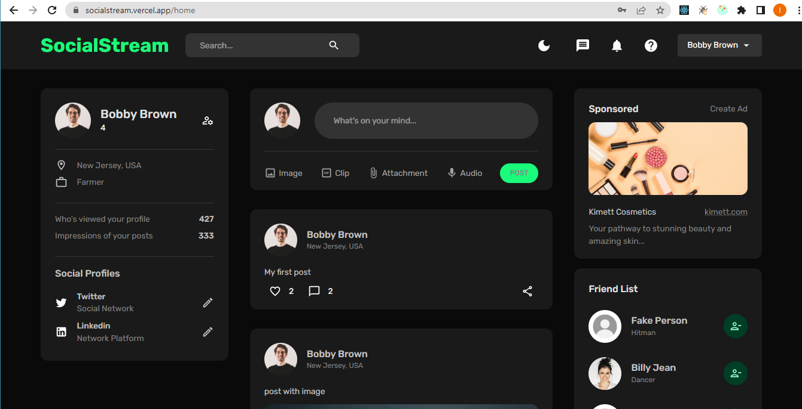

# SocialStream Frontend

Frontend for the SocialStream App

## Overview

SocialStream is a social media web application built on the MERN stack (MongoDB, Express, React and NodeJs). The frontend is built with Material UI styling library. It also utilizes redux toolkit for state management.

## Screenshot

